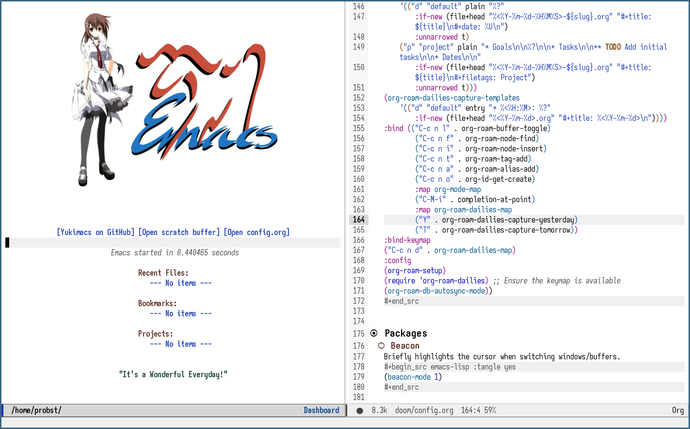

#+TITLE: yukimacs-doom
#+AUTHOR: pprobst
#+DESCRIPTION: Yukimacs, but DOOM.
#+STARTUP: showeverything

* Table of Contents :TOC:
- [[#installation][Installation]]
- [[#general][General]]
  - [[#shell-configuration][Shell configuration]]
  - [[#user][User]]
  - [[#font][Font]]
  - [[#theme][Theme]]
  - [[#dashboard][Dashboard]]
  - [[#qol][QoL]]
- [[#dired][Dired]]
  - [[#file-associations][File associations]]
- [[#org][Org]]
  - [[#org-mode][Org mode]]
  - [[#org-roam][Org-roam]]
- [[#packages][Packages]]
  - [[#beacon][Beacon]]
  - [[#treemacs][Treemacs]]
  - [[#history-length][History length]]
  - [[#auto-activation-snippets][Auto-activation snippets]]
  - [[#yasnippet][YASnippet]]
  - [[#keycast][Keycast]]
  - [[#imenu-list][Imenu-list]]
  - [[#info-colors][info-colors]]
  - [[#ruff-format][ruff-format]]
- [[#latex][LaTeX]]
- [[#python-lsp-configuration][Python LSP Configuration]]

* Installation
Make sure you have [[https://github.com/doomemacs/doomemacs][Doom Emacs]] already installed, then:

=git clone https://github.com/pprobst/yukimacs-doom.git ~/.config/doom=

=git clone --depth 1 https://gitlab.com/protesilaos/iosevka-comfy.git ~/.local/share/fonts/iosevka-comfy=

* General
** Shell configuration
Fix Fish shell compatibility issues (non-POSIX shell).
#+begin_src emacs-lisp :tangle yes
(setq shell-file-name (executable-find "bash"))
(setq-default vterm-shell "/usr/bin/fish")
(setq-default explicit-shell-file-name "/usr/bin/fish")
#+end_src

** User
Some functionality uses this to identify you, e.g. GPG configuration, email clients, file templates and snippets. It is optional.
#+begin_src emacs-lisp :tangle yes
;(setq user-full-name "pprobst"
;      user-mail-address "pprobst@insiberia.net")
#+end_src

** Font
 Doom exposes five (optional) variables for controlling fonts in Doom:
 - =doom-font= -- the primary font to use.
 - =doom-variable-pitch-font= -- a non-monospace font (where applicable)
 - =doom-big-font= -- used for =doom-big-font-mode=; use this for
   presentations or streaming.
 - =doom-unicode-font= -- for unicode glyphs.
 - =doom-serif-font= -- for the =fixed-pitch-serif= face; See =C-h v doom-font= for documentation and more examples of what they accept.

 #+begin_src emacs-lisp :tangle yes
(setq doom-font (font-spec :family "Aporetic Sans Mono" :size 15)
      doom-variable-pitch-font (font-spec :family "Aporetic Sans Mono" :size 15)
      doom-big-font (font-spec :family "Aporetic Sans Mono" :size 20))

(after! doom-themes
  (setq doom-themes-enable-bold t
        doom-themes-enable-italic t))

(custom-set-faces!
    '(font-lock-comment-face :slant italic)
    '(font-lock-keyword-face :slant italic))
 #+end_src

** Theme
#+begin_src emacs-lisp :tangle yes
;; Some dark themes
;;(setq doom-theme 'yukimacs)
;;(setq doom-theme 'modus-vivendi-tinted)
;;(setq doom-theme 'modus-vivendi)
;;(setq doom-theme 'doom-one)
;;(setq doom-theme 'doom-gruvbox)
;;(setq doom-theme 'doom-tomorrow-night)
(setq doom-theme 'doom-tokyo-night)

;; Some light themes
;;(setq doom-theme 'modus-operandi)
;;(setq doom-theme 'modus-operandi-tinted)
;;(setq doom-theme 'doom-one-light)
;;(setq doom-theme 'doom-gruvbox-light)
;;(setq doom-theme 'doom-tomorrow-day)
#+end_src

** Dashboard
#+begin_src emacs-lisp :tangle yes
(setq fancy-splash-image "~/.config/doom/banners/yukimacs-logo-classic-smaller.png")
#+end_src

** QoL
*** Indent guides
#+begin_src emacs-lisp :tangle yes
(use-package! indent-bars
  :hook ((prog-mode) . indent-bars-mode)) ; or whichever modes you prefer
(setq
    indent-bars-color '(highlight :face-bg t :blend 0.15)
    indent-bars-pattern "."
    indent-bars-width-frac 0.5
    indent-bars-pad-frac 0.25
    indent-bars-zigzag nil
    indent-bars-color-by-depth '(:regexp "outline-\\([0-9]+\\)" :blend 1) ; blend=1: blend with BG only
    indent-bars-highlight-current-depth '(:blend 0.5) ; pump up the BG blend on current
    indent-bars-display-on-blank-lines t)
#+end_src

*** Display Line Numbers
#+begin_src emacs-lisp :tangle yes
;; For relative line numbers, set this to `relative`.
(setq display-line-numbers-type t)
#+end_src

*** Open specific files
#+begin_src emacs-lisp :tangle yes
(map! :leader
      (:prefix ("=" . "open file")
       :desc "Edit doom config.org"  "c" #'(lambda () (interactive) (find-file "~/.config/doom/config.org"))
       :desc "Edit doom init.el"     "i" #'(lambda () (interactive) (find-file "~/.config/doom/init.el"))
       :desc "Edit doom packages.el" "p" #'(lambda () (interactive) (find-file "~/.config/doom/packages.el"))))
#+end_src

*** Switches cursor automatically to new window
#+begin_src emacs-lisp :tangle yes
(defun split-and-follow-horizontally ()
    (interactive)
    (split-window-below)
    (balance-windows)
    (other-window 1))
(global-set-key (kbd "C-x 2") 'split-and-follow-horizontally)

(defun split-and-follow-vertically ()
    (interactive)
    (split-window-right)
    (balance-windows)
    (other-window 1))
(global-set-key (kbd "C-x 3") 'split-and-follow-vertically)
#+end_src

*** Disable lsp-lens-mode for performance
#+begin_src emacs-lisp :tangle yes
(setq lsp-lens-enable nil)
#+end_src

* Dired
** File associations
#+begin_src emacs-lisp :tangle yes
(setq dired-open-extensions '(("jpg" . "nsxiv")
                              ("png" . "nsxiv")
                              ("mkv" . "mpv")
                              ("mp3" . "mpv")
                              ("mp4" . "mpv")))
#+end_src

* Org
** Org mode
#+begin_src emacs-lisp :tangle yes
(custom-set-faces!
    '(org-level-1 :inherit outline-1 :height 1.3)
    '(org-level-2 :inherit outline-2 :height 1.2)
    '(org-level-3 :inherit outline-3 :height 1.1)
    '(org-level-4 :inherit outline-4 :height 1.0)
    '(org-level-5 :inherit outline-5 :height 1.0))
#+end_src

** Org-roam
A plain-text personal knowledge management system.
#+begin_src emacs-lisp :tangle yes
(use-package! org-roam
:custom
(org-roam-directory "~/Notes")
(org-roam-completion-everywhere t)
(org-roam-capture-templates
    ;; "d" is the letter you'll press to choose the template.
    ;; "default" is the full name of the template.
    ;; plain is the type of text being inserted.
    ;; "%?" is the text that will be inserted.
    ;; unnarrowed t ensures that the full file will be displayed when captured.
    '(("d" "default" plain "%?"
        :if-new (file+head "%<%Y-%m-%d-%H%M%S>-${slug}.org" "#+title: ${title}\n#+date: %U\n")
        :unnarrowed t)
    ("p" "project" plain "* Goals\n\n%?\n\n* Tasks\n\n** TODO Add initial tasks\n\n* Dates\n\n"
        :if-new (file+head "%<%Y-%m-%d-%H%M%S>-${slug}.org" "#+title: ${title}\n#+filetags: project")
        :unnarrowed t)))
    (org-roam-dailies-capture-templates
        '(("d" "default daily" entry
        "* %<%H:%M> %?"
        :if-new (file+head "%<%Y-%m-%d>.org" "#+title: %<%Y-%m-%d %A>\n#+filetags: daily"))
        ("t" "task" entry
        "* TODO %?"
        :if-new (file+head "%<%Y-%m-%d>.org" "#+title: %<%Y-%m-%d %A>\n#+filetags: daily")
        :unnarrowed t)))
:bind (("C-c n l" . org-roam-buffer-toggle)
        ("C-c n f" . org-roam-node-find)
        ("C-c n i" . org-roam-node-insert)
        ("C-c n t" . org-roam-tag-add)
        ("C-c n a" . org-roam-alias-add)
        ("C-c n o" . org-id-get-create)
        :map org-mode-map
        ("C-M-i" . completion-at-point)
        :map org-roam-dailies-map
        ("Y" . org-roam-dailies-capture-yesterday)
        ("T" . org-roam-dailies-capture-tomorrow))
:bind-keymap
("C-c n d" . org-roam-dailies-map)
:config
(org-roam-setup)
(require 'org-roam-dailies) ;; Ensure the keymap is available
(org-roam-db-autosync-mode))

(defun bms/org-roam-rg-search ()
  "Search org-roam directory using consult-ripgrep. With live-preview."
  (interactive)
  (let ((consult-ripgrep "rg --null --multiline --ignore-case --type org --line-buffered --color=always --max-columns=500 --no-heading --line-number . -e ARG OPTS"))
    (consult-ripgrep org-roam-directory)))
(global-set-key (kbd "C-c rr") 'bms/org-roam-rg-search)
#+end_src

* Packages
** Beacon
Briefly highlights the cursor when switching windows/buffers.
#+begin_src emacs-lisp :tangle yes
(beacon-mode 1)
#+end_src

** Treemacs
Display files in a tree-like structure.
#+begin_src emacs-lisp :tangle yes
(use-package! treemacs
:config
(setq treemacs-width 30)
:bind (:map global-map
    ("C-x t t" . treemacs)
    ("C-x t 1" . treemacs-select-window)))
#+end_src

** History length
Remember more minibuffer/command history.
#+begin_src emacs-lisp :tangle yes
(setq-default history-length 1000)
#+end_src

** Auto-activation snippets
#+begin_src emacs-lisp :tangle yes
(use-package! aas
  :commands aas-mode)

;; Same as above but specifically for LaTeX.
(use-package! laas
  :hook (LaTeX-mode . laas-mode)
  :config
  (defun laas-tex-fold-maybe ()
    (unless (equal "/" aas-transient-snippet-key)
      (+latex-fold-last-macro-a)))
  (add-hook 'aas-post-snippet-expand-hook #'laas-tex-fold-maybe))
#+end_src

** YASnippet
Nested snippets.
#+begin_src emacs-lisp :tangle yes
(setq yas-triggers-in-field t)
#+end_src

** Keycast
Show what you're doing on-screen.
#+begin_src emacs-lisp :tangle yes
(use-package! keycast
  :after doom-modeline
  :commands keycast-mode
  :config
  (define-minor-mode keycast-mode
    "Show current command and its key binding in the mode line."
    :global t
    (if keycast-mode
        (progn
          (add-hook 'pre-command-hook 'keycast--update t)
          (add-to-list 'global-mode-string '("" keycast-mode-line " ")))
      (remove-hook 'pre-command-hook 'keycast--update)
      (setq global-mode-string (remove '("" keycast-mode-line " ") global-mode-string))))
  (keycast-mode))
#+end_src

** Imenu-list
Imenu produces menus for accessing locations in documents, typically in the current buffer.
'imenu-list' has imenu displayed as a vertical split that you can toggle show/hide.

| COMMAND                 | DESCRIPTION                      | KEYBINDING |
|-------------------------+----------------------------------+------------|
| imenu-list-smart-toggle | /Toggle imenu shown in a sidebar/  | SPC t i    |

#+BEGIN_SRC emacs-lisp :tangle yes
(setq imenu-list-focus-after-activation t)
(map! :leader
      (:prefix ("t" . "Toggle")
       :desc "Toggle imenu shown in a sidebar" "i" #'imenu-list-smart-toggle))
#+END_SRC

** info-colors
Colorful manual pages.
#+BEGIN_SRC emacs-lisp :tangle yes
(use-package! info-colors
  :commands (info-colors-fontify-node))

(add-hook 'Info-selection-hook 'info-colors-fontify-node)
#+END_SRC

** ruff-format
Configure ruff as the Python formatter (built into Doom's Python module).
Format-on-save is already enabled via the =(format +onsave)= flag in init.el.
#+BEGIN_SRC emacs-lisp :tangle yes
(set-formatter! 'ruff :modes '(python-mode python-ts-mode))
#+END_SRC

* LaTeX
#+begin_src emacs-lisp :tangle yes
;; Change file viewer.
(setq +latex-viewers '(zathura))

;; Using cdlatex’s snippets despite having yasnippet.
(map! :map cdlatex-mode-map
      :i "TAB" #'cdlatex-tab)
#+end_src

* Python LSP Configuration
Configure basedpyright as the language server for Python.
#+begin_src emacs-lisp :tangle yes
(setq lsp-pyright-langserver-command "basedpyright")
#+end_src
